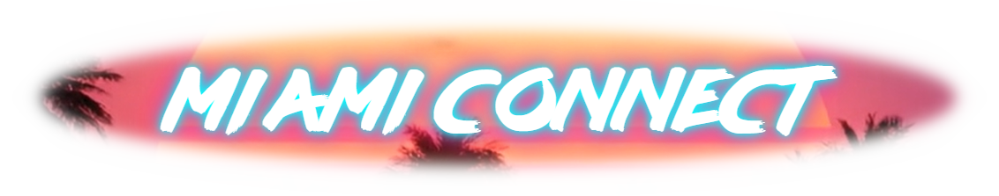

# 🌴 Miami Connect

> *"Where Retro Meets Rolodex - Your Contacts, Miami Vice Style!"*

Miami Connect is a stylish, 80s-inspired contact management system that brings the aesthetic of Miami Vice to your digital rolodex. Built with modern web technologies but styled with a retro twist, it's the perfect blend of form and function.

## 🌅 Features

- **Rad Authentication System**: Secure login/register with neon-styled forms
- **Tubular Contact Management**: Add, edit, and organize your contacts with style
- **Some Security**: Data protection with modern(ish) security practices
- **Totally Responsive**: Works smoothly across mostly big devices, just like a Ferrari on Ocean Drive
- **Retro-Modern UI**: Glassmorphic cards, neon glows, and Miami sunset vibes

## 🎨 Design & Theme

Miami Connect features a carefully crafted aesthetic that includes:

- **Color Palette**:
  - Aqua Blue (`#00ffff`): Primary action elements
  - Hot Pink (`#FF1493`): Accent and hover states
  - Deep Navy (`#1A1B4B`): Background tones
  - Pure White (`#F5F5FF`): Text and highlights

- **Typography**:
  - LAZER84: For main headings, bringing that authentic 80s feel
  - Eurostile: For body text, maintaining readability with retro flair

- **Visual Effects**:
  - Neon glow effects on buttons and text
  - Glassmorphic cards and modals
  - Synthwave-inspired backgrounds
  - Responsive hover animations

## 🛠️ Technical Stack

- **Frontend**:
  - HTML5
  - CSS with custom animations
  - JavaScript (Vanilla)
  - Bootstrap 5.3.2

- **Backend**:
  - RESTful API architecture
  - (Un)securly hashed passwords with MD5
  - Contact data management

## 💾 Usage Guide

1. **Register**: Join the force with your credentials
2. **Login**: Access your personal command center
3. **Manage**: Edit, delete, or search through your contacts
4. **Stay Rad**: Enjoy the nostalgic vibes while staying organized

## 🎮 Vice Mode

*There might be a totally tubular surprise button in the app. Keep your eyes peeled!*

## 📱 Responsive Design

Miami Connect is probably going to work for:
- 📱 Mobile devices
- 💻 Tablets
- 🖥️ Desktop screens
- 📺 Ultra-wide displays

## 🌟 Accessibility

We've ensured accessibility checkpoints such as:
- High contrast ratios
- Form labels
- Consistent navigation
- High Lighthouse Ratings

## 🙏 Acknowledgments

- Inspired by Miami Vice (1984-1990)
- Built with love for the 80s

---

*"Stay cool, and keep your contacts closer!"* 🌴✨

